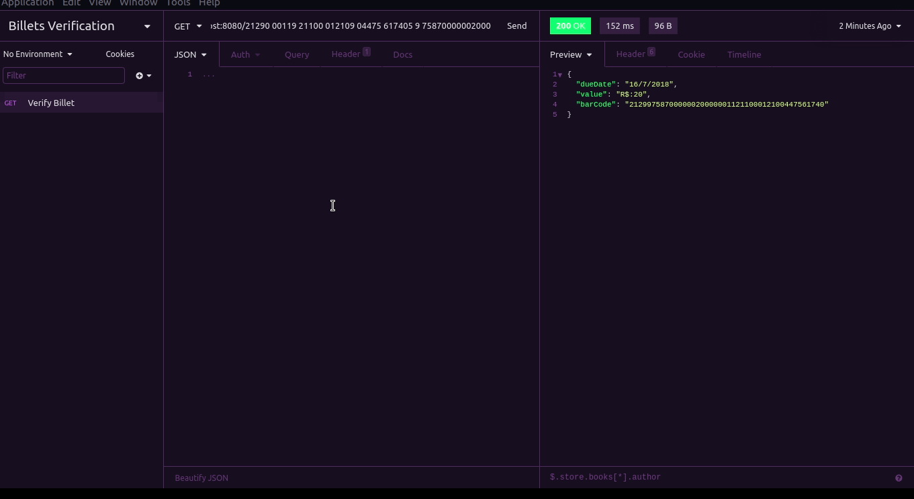

<h1 align="center">
  
</h1>
  
<h1>

</h1>

## 📝 Description

<p>This challenge aims to verify typable rows of bank billets, verifying if they are valid or not. If valid so it should return billet value and due date.</p>

---

## 💻 Used Technologies

<p>This challenge has been developed using the following technologies:</p>

- [Node.js](https://nodejs.org/en/)
- [TypeScript](https://www.typescriptlang.org/)
- [Insomnia](https://insomnia.rest/download/)

---

## 📁 Download

```bash
# Clone the repository
$ git clone https://github.com/jose-renato-m/ewally-challenge.git

# Enter into the directory
$ cd ewally-challenge

# Install dependencies
$ yarn

# Start the server
$ yarn dev
```
Obs.: to test the route, it needs to use Insomnia application.

---

Made with <span role="img" arial-label="coração">💙</span> by José Renato Montagnana <span role="img" arial-label="saudação">👋🏻</span> [Get in touch!](https://github.com/jose-renato-m/netflixclone)
